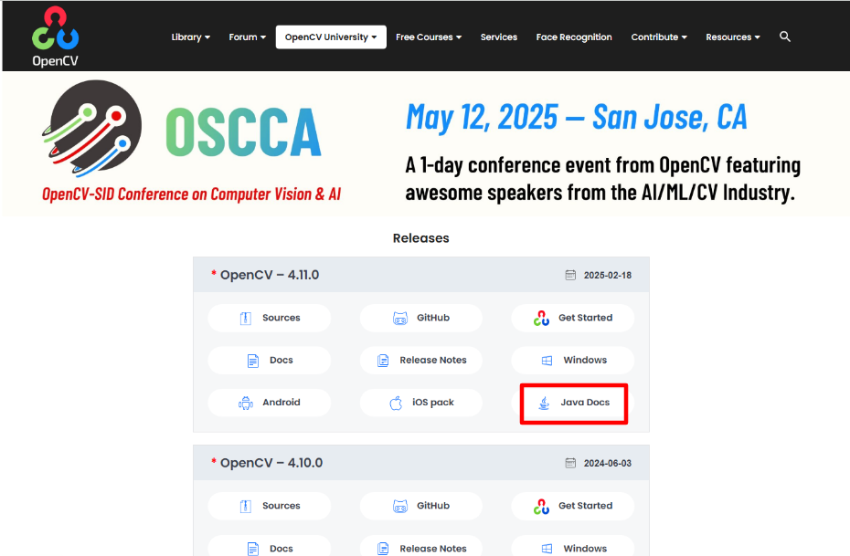
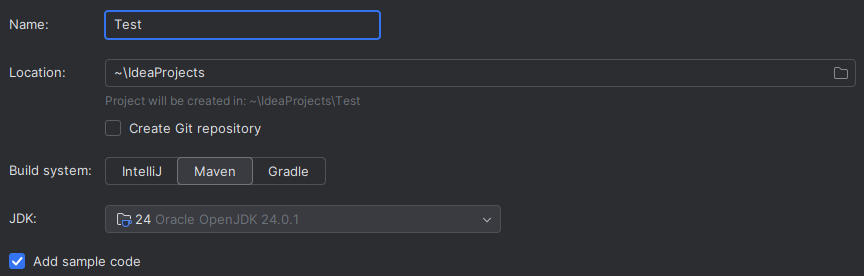
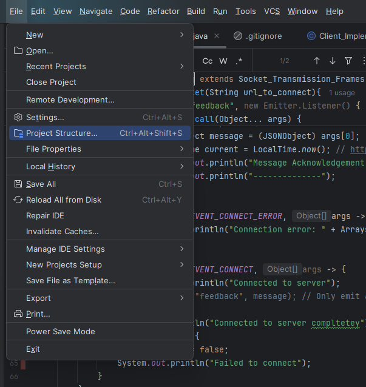
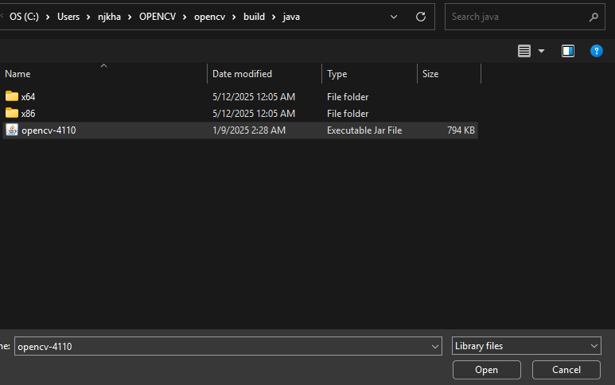
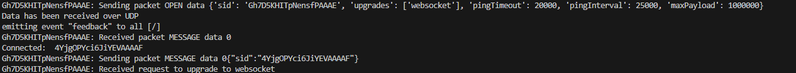
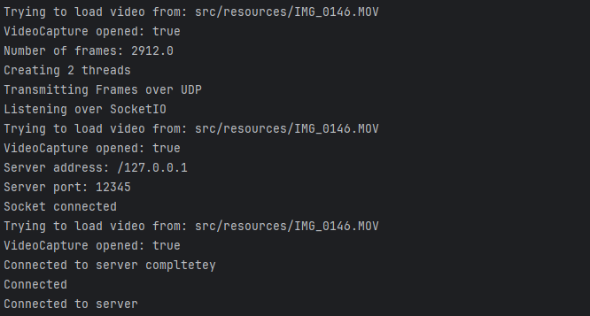
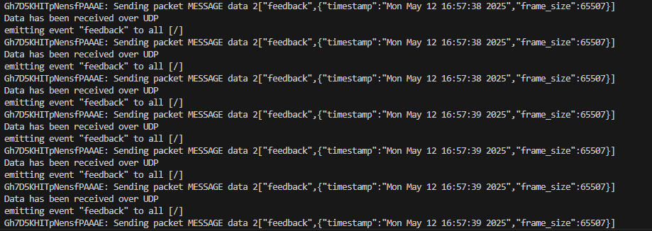
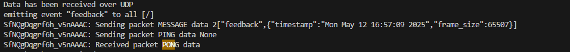
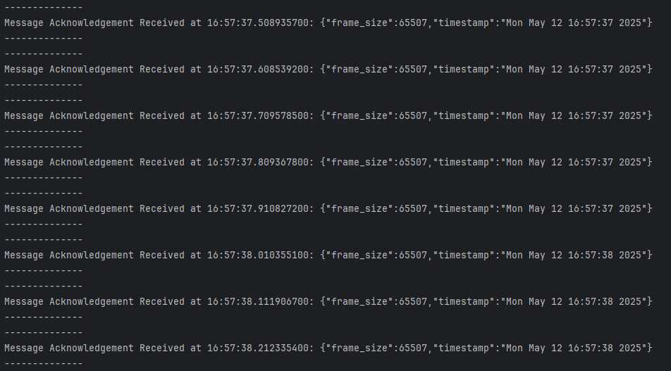

# Real-Time-Video-Streaming-with-a-Python-Java-Client-Server-System
A real-time multimedia communication system involving cross-platform networking

# Code Breakdown
Based on experimentally examining the frame size, the maximum number of bytes for each fram is 2073600. For this reason, the code is specifically designed to handle this alrge number in a specific way. All things considered, the nuanced approach will simply regard the maximum number of bytes to send. For debugging purposes and to ensure accurate execution, this number will be assumed for verification purposes. However, the code is designed in such a way that this number is simply relative to whatever the quotient of frame lengths and 65507 is. 

For this implementation, the assumption that no segment is lost is assumed for ease. One big thing I noticed after scouring multiple stack exchanges to see if there is some way to bchange the size and sadly there appears not to be. 

# How to Set Up
In terms of set-up, there are a couple of additional steps that need to be taken to ensure compatibility with the code base primarily on the Java Client side.  Ensure you are using Python version  3.13. 

1. Install all of the necessary libraries for the Python server code as listed below:
    - datetime
    - asyncio
    - aiohttp
    - threading
    - socket
    - socketio

For the installation of socketio, use the following command:
        pip install python-socketio
2. Java Client set up
    To set up the Java Client, ensure that the latest version of OpenCV Java Docs is installed. 

    If it is not downloaded, then go to the [OpenCv website](https://opencv.org/releases/). On this page, click on the link in the red box in the image below. From clicking on this, it should download a file. Be sure to open that file and create a directory to house all of these file.

            

    After this, create a Java proejct in IntelliJ with the  Maven build option and Oracle JDK version 24.0.1.\
    

    Once the project is created with the above settings, go to File then click on Project Structure as seen below.
    

    Next, click on Modules under Project Settings. Then click to add in a Jar file. Traverse to the directory with your downloaded Java Docs OpenCV files. In this folder, click on the build folder followed by the java folder. Load/open in the opencv-4110 file.
   

   Afterwards, double click on the file that was just loaded in. Click on the leftmost plus button to add in the dll file which is based on whether you have an x86 or x64 processing system. 

   The next step is to load in all of the dependecies which have already been done in the pom.xml file. After doing these steps, this should ensure that there is compatibility to rub the codebase. 
3. To run the code, first start up the Python server by typing in 
        python3.13 communication.py
    The python server will wait in the background for a connection to be made. Once a connection is made, it will show the following image.
    
4. Next start up the Java Client by running the main function in the Main class in IntelliJ. Before the connection is made and the acknowledgement messages are sent. The terminal should look like the following.

    
5. The Java client will run to completion and return a Message Acknowledgement everytime something is communicated over SocketIO from the server. The Message Acknowledgement termianl outputs should show the JSON object with hte frame size and timestamp included.  

# Verification and Evidence

The image below shows the 

If there is an extended delay in a packet being received, the following image is shown.

Upon starting of the execution, the image below is seen:

# Additional Resources used Throughout the Code
- https://stackoverflow.com/questions/3396813/message-too-long-for-udp-socket-after-setting-sendbuffersize
- https://socket.io/docs/v4/

